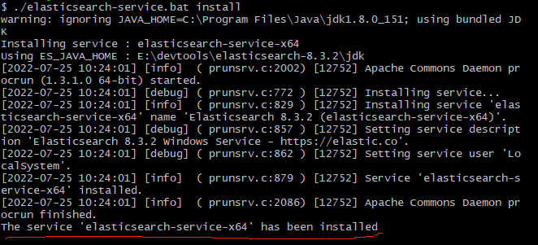
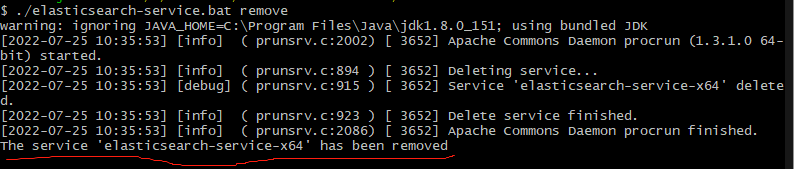
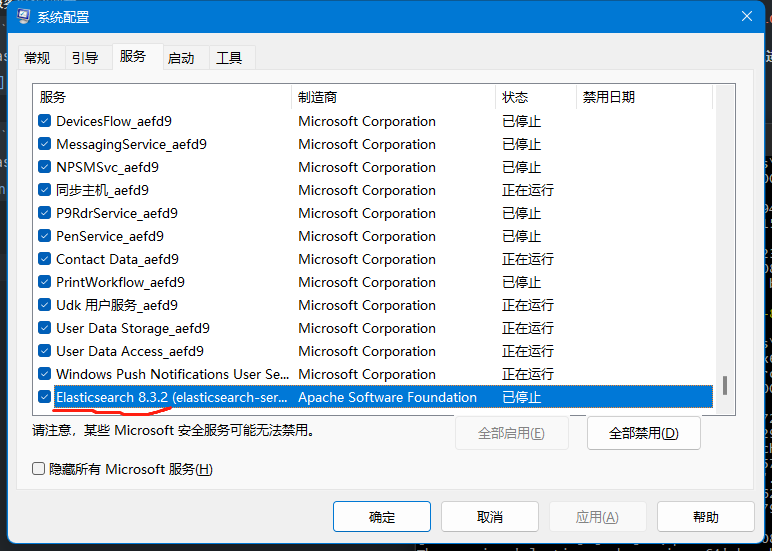
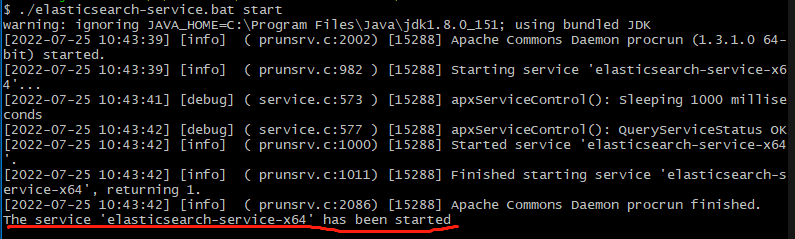
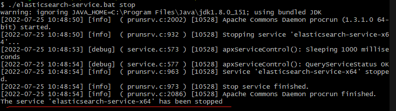
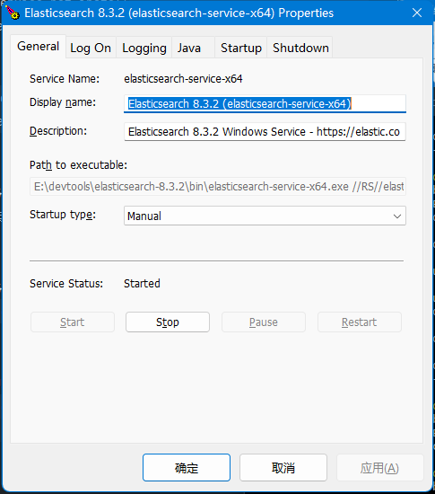
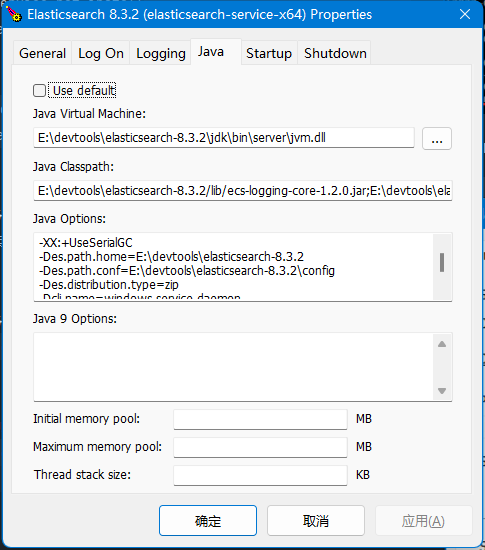

#Windows 安装 Elasticsearch 及开机启动

##### 1.下载Elasticsearch:
下载地址:<https://www.elastic.co/cn/downloads/elasticsearch>  

##### 2.解压下载的Elasticsearch,进入elasticsearch-8.3.2\bin目录下
##### 3.服务安装&卸载
安装命令： `./elasticsearch-service.bat installc`
或: `./elasticsearch-service.bat install 指定服务名称`

卸载命令： `./elasticsearch-service.bat remove`
或: `./elasticsearch-service.bat remove 指定服务名称`

##### 4.查看Elasticsearch服务是否已安装  
命令`cmd` -> `msconfig` -> 点击服务，发现服务已安装[已停止]

##### 5.启动Elasticsearch
命令 `./elasticsearch-service.bat  start`

##### 6.关闭Elasticsearch
命令 `./elasticsearch-service.bat  stop`

##### 7.启动Elasticsearch GUI管理，调整参数
命令 `./elasticsearch-service.bat  manager`

至此Windows 安装 Elasticsearch 完结 
